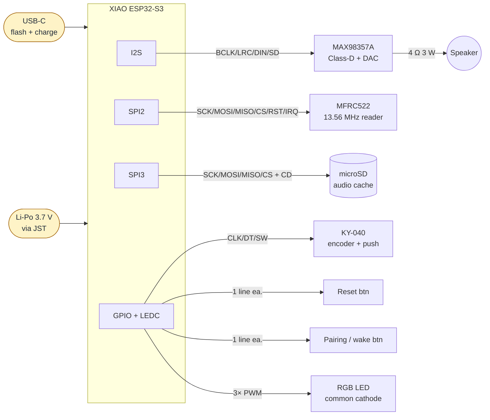

# Hardware assembly

How the Hush prototype is wired together. The **canonical pin assignments
live in [`src/hw/pins.rs`](../src/hw/pins.rs)** — this document and the
diagrams it embeds are derived from that file. If the two ever disagree,
`pins.rs` wins and the diagrams should be regenerated.

For the per-pin table (direction, pull, notes), see [`PIN_MAP.md`](./PIN_MAP.md).

## System block diagram

The XIAO ESP32-S3 sits at the centre. Three buses leave the MCU (I2S to the
amplifier, SPI2 to the RFID reader, SPI3 to the microSD cache); the rest of
the peripherals are wired to plain GPIOs.



## Pin-to-pin wiring (WireViz)

Source: [`hardware/wiring.yml`](../hardware/wiring.yml). Renderings are
committed alongside the source so GitHub displays them without local tooling.


A standalone HTML version with the BOM lives at
[`hardware/wiring.html`](../hardware/wiring.html), and the bill of materials
in TSV form at [`hardware/wiring.bom.tsv`](../hardware/wiring.bom.tsv).

## Power-rail notes

- **MAX98357A** runs from the 3V3 rail in this design. That keeps the device
  single-rail (battery and USB both feed the XIAO's 3V3 regulator) at the
  cost of max acoustic output vs. running from 5V/VBUS. If a later phase
  decides we need more volume, route VIN to 5V and gate it on the boost
  converter rather than mixing rails silently.
- **MFRC522** is a 3.3 V-only module. Never wire VCC to 5V.
- **microSD** breakouts often have a 3V3 regulator on board; ours is fed
  3V3 directly and the regulator is bypassed. Confirm before swapping
  modules.
- **The XIAO's `5V` pin is USB VBUS only** — it does *not* expose the
  battery rail upward. Treat it as "USB only", not as a power source for
  peripherals that must run on battery.

## Mechanical / breadboard reality

The XIAO ESP32-S3's 14-pin edge header exposes 3V3, two GND pads, 5V, and
GPIO 1..9 / 43 / 44. **The remaining GPIOs used by Hush (10, 11, 12, 13,
17, 18, 21, 33..37) are on the back-side castellated pads** and must be
soldered from underneath — either with thin wires direct to the pads, or
via an adapter board such as the [Seeed XIAO Expansion Adapter](https://wiki.seeedstudio.com/Seeeduino-XIAO-Expansion-Board/)
that breaks them out.

## Regenerating the diagram

```bash
cd hardware/
make setup          # one-time: creates .venv and installs WireViz
make regen          # re-render wiring.{svg,png,html,bom.tsv}
```

`graphviz` must be on `PATH` (`brew install graphviz` on macOS,
`apt install graphviz` on Debian/Ubuntu). The Python virtualenv is
gitignored; the WireViz outputs are committed so the README renders
correctly on GitHub.

When changing `wiring.yml`, run `make regen` and commit all four
generated files alongside the YAML.

## Why WireViz, not Fritzing / KiCad

| Tool | What we use it for | Why not here |
|---|---|---|
| **WireViz** | Pin-to-pin wiring of the breadboard build | — (current choice) |
| Fritzing | Visual breadboard sketches | Binary `.fzz` is hard to diff, and several Hush parts (XIAO ESP32-S3, MAX98357A) aren't in the default library |
| KiCad | Real EE schematic + PCB layout | Overkill while the device is breadboard-only; revisit when designing a custom PCB |
| Mermaid | High-level block diagram (above) | Doesn't model real wiring — used alongside WireViz, not instead of it |
