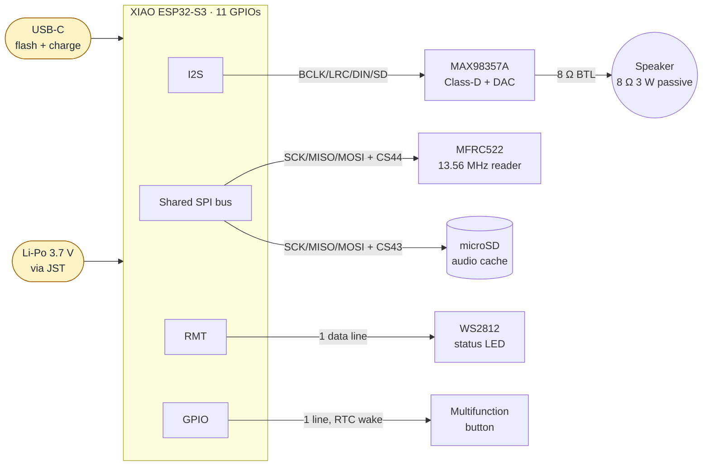
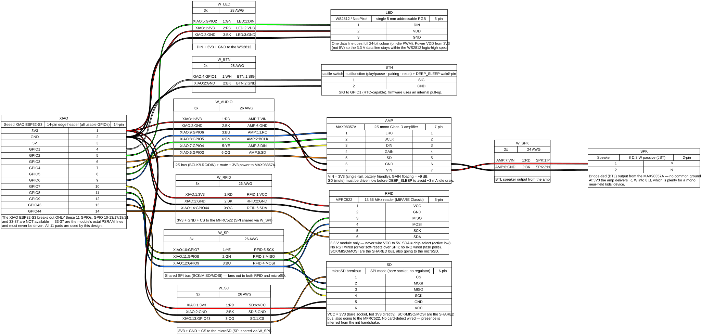

# Hardware assembly

How the Hush prototype is wired together. The **canonical pin assignments
live in [`src/hw/pins.rs`](../src/hw/pins.rs)** — this document and the
diagrams it embeds are derived from that file. If the two ever disagree,
`pins.rs` wins and the diagrams should be regenerated.

For the per-pin table (direction, pull, notes), see [`PIN_MAP.md`](./PIN_MAP.md).

## System block diagram

The XIAO ESP32-S3 sits at the centre. It exposes only 11 GPIOs, so the design
is tight: I2S to the amplifier, **one shared SPI bus** carrying both the RFID
reader and the microSD (a chip-select each), one data line to a WS2812 status
LED, and one multifunction button. The rotary encoder and a second button are
dropped in v1 for lack of pins (see [`PLAN.md`](../PLAN.md)).



> RFID has no RST pin (soft-reset over SPI) and no IRQ pin (the task polls);
> the microSD has no card-detect pin (presence inferred at mount). All three
> were dropped to fit the 11-pad budget — see [`PIN_MAP.md`](./PIN_MAP.md).

## Pin-to-pin wiring (WireViz)

Source: [`hardware/wiring.yml`](../hardware/wiring.yml). Renderings are
committed alongside the source so GitHub displays them without local tooling.



A standalone HTML version with the BOM lives at
[`hardware/wiring.html`](../hardware/wiring.html), and the bill of materials
in TSV form at [`hardware/wiring.bom.tsv`](../hardware/wiring.bom.tsv).

## Power-rail notes

- **MAX98357A** runs from the 3V3 rail in this design. That keeps the device
  single-rail (battery and USB both feed the XIAO's 3V3 regulator) at the
  cost of max acoustic output vs. running from 5V/VBUS. If a later phase
  decides we need more volume, route VIN to 5V and gate it on the boost
  converter rather than mixing rails silently.
- **MFRC522** is a 3.3 V-only module. Never wire VCC to 5V.
- **microSD** breakouts often have a 3V3 regulator on board; ours is fed
  3V3 directly and the regulator is bypassed. Confirm before swapping
  modules.
- **The XIAO's `5V` pin is USB VBUS only** — it does *not* expose the
  battery rail upward. Treat it as "USB only", not as a power source for
  peripherals that must run on battery.

## Mechanical / breadboard reality

The XIAO ESP32-S3's 14-pin edge header exposes 3V3, GND, 5V, and GPIO
`1..9 / 43 / 44` — **that is every usable GPIO on the board (11 of them).**
There are no back-side general-purpose GPIO pads to fall back on: GPIO
`10-13 / 17 / 18 / 21` are not routed out, and `33-37` are bonded to the
module's **octal PSRAM** — driving them corrupts PSRAM. This 11-pad ceiling is
the reason RFID + microSD share one SPI bus, the LED is a single WS2812, and
the encoder / second button are dropped in v1.

All 11 pads sit on the top edge header, so the whole build solders (or
breadboards via a header strip) from the top — no under-side pad work. If a
future revision genuinely needs the encoder or more I/O, that is a
**board change** (e.g. an ESP32-S3 DevKitC-1 with ~40 GPIOs), not an adapter
for the XIAO — see [`PLAN.md`](../PLAN.md) § Decisions.

## Regenerating the diagram

```bash
cd hardware/
make setup          # one-time: creates .venv and installs WireViz
make regen          # re-render wiring.{svg,png,html,bom.tsv}
```

`graphviz` must be on `PATH` (`brew install graphviz` on macOS,
`apt install graphviz` on Debian/Ubuntu). The Python virtualenv is
gitignored; the WireViz outputs are committed so the README renders
correctly on GitHub.

When changing `wiring.yml`, run `make regen` and commit all four
generated files alongside the YAML.

## Why WireViz, not Fritzing / KiCad

| Tool | What we use it for | Why not here |
|---|---|---|
| **WireViz** | Pin-to-pin wiring of the breadboard build | — (current choice) |
| Fritzing | Visual breadboard sketches | Binary `.fzz` is hard to diff, and several Hush parts (XIAO ESP32-S3, MAX98357A) aren't in the default library |
| KiCad | Real EE schematic + PCB layout | Overkill while the device is breadboard-only; revisit when designing a custom PCB |
| Mermaid | High-level block diagram (above) | Doesn't model real wiring — used alongside WireViz, not instead of it |
